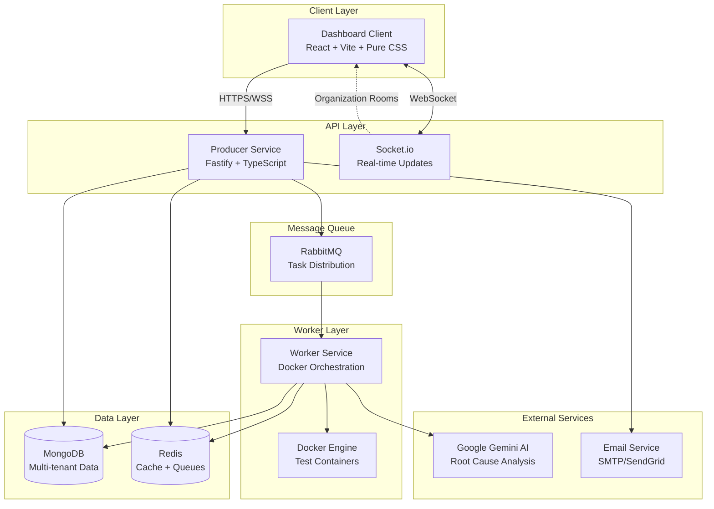

# Agnostic Automation Center

> A high-performance, multi-tenant test automation platform designed to be **language and framework agnostic**.

Run any containerized automation suite (Playwright, Pytest, JUnit, Cypress, etc.) on a remote server with real-time monitoring, live logs, and AI-powered failure analysis. Built for teams with complete data isolation between organizations.


---

## 🎯 What Problem Does This Solve?

**The Challenge:** Test automation teams struggle with:
- Managing different frameworks (Playwright, Selenium, Pytest, etc.) across environments
- Debugging failures without clear root cause analysis
- Scaling test infrastructure for multiple teams
- Maintaining secure, isolated test environments

**The Solution:** Agnostic Automation Center provides:
- **Framework-agnostic execution** - Bring your own Docker image, we handle the rest
- **AI-powered debugging** - Instant root cause analysis for test failures
- **Multi-tenant SaaS** - Complete isolation between teams/organizations
- **Real-time monitoring** - Live logs, WebSocket updates, interactive dashboard
- **Smart environment management** - Dynamic configuration injection per test run

---

## ✨ Key Features

### 🧠 AI-Powered Root Cause Analysis

No more digging through thousands of log lines.

- **Automatic Detection:** When tests fail, the system captures logs automatically
- **Gemini 2.5 Flash:** Analyzes failure context, identifies exact errors, suggests fixes
- **Privacy Controls:** Organization-level toggle to opt-out of AI processing
- **Instant Reports:** View styled analysis directly in dashboard via ✨ icon

### 🏢 Multi-Tenant SaaS Architecture

Complete isolation and security for multiple organizations.

- **Organization Management:** Each signup creates an isolated organization
- **Team Collaboration:** Invite members with role-based permissions (Admin/Developer/Viewer)
- **Data Isolation:** Organizations cannot see or access each other's data
- **Usage Tracking:** Per-organization quotas and limits based on subscription plan

### 🎨 Interactive Dashboard

Modern React-based UI built with Vite + Pure CSS.

- **Manual Triggers:** Launch tests directly from UI using Execution Modal
- **Dynamic Configuration:** Select environments (Dev/Staging/Prod), folders, Docker images on-the-fly
- **Live Monitoring:** Watch console logs stream in real-time via WebSockets
- **Mobile Responsive:** Full mobile and tablet support with responsive Pure CSS
- **Settings Management:** Manage team members, organization settings, usage quotas

### 🔐 Enterprise-Grade Security

Built with security best practices from the ground up.

- **JWT Authentication:** Stateless authentication with bcrypt password hashing
- **Role-Based Access Control (RBAC):** Admin, Developer, Viewer roles
- **Rate Limiting:** Per-organization and per-IP rate limiting (Redis-based)
- **Account Protection:** Login attempt tracking with automatic lockout (15 min after 5 failures)
- **Security Headers:** OWASP-recommended headers (HSTS, X-Frame-Options, CSP-ready)
- **CORS Protection:** Environment-based origin validation

### 🚀 Smart Environment Mapping

Framework-agnostic environment configuration.

- **Agnostic Environments:** Define environments via infrastructure ENV variables
- **Auto-Switching:** UI automatically maps environment selection to correct URL
- **Dynamic Injection:** Environment variables injected into containers at runtime
- **Secret Management:** Sensitive data never hardcoded, always injected

### 💳 Billing & Subscription Management

Integrated Stripe-powered subscription system.

- **Subscription Plans:** Free, Team, and Enterprise tiers with different limits
- **Stripe Integration:** Secure payment processing via Stripe Checkout
- **Plan Limits Enforcement:** Test runs, team members, concurrent runs per plan
- **Usage Tracking:** Real-time usage statistics and quota monitoring
- **Self-Service Billing:** Upgrade/downgrade plans directly from dashboard

### 👤 User Profile Management

Personal account management for all users.

- **Profile Settings:** Update name and view account details
- **Read-Only Security:** Email and role displayed but not editable by user
- **Role-Based Access:** Profile visible to all, role changes by admins only

### 📧 Email Integration

Professional email communications via SendGrid.

- **Team Invitations:** Beautiful HTML email invitations with one-click join
- **Welcome Emails:** Onboarding emails for new team members
- **Transactional Emails:** Password reset, notifications (coming soon)

---

## 🏗️ System Architecture



### Component Overview

| Component | Technology | Purpose |
|-----------|-----------|---------|
| **Dashboard Client** | React 19 + TypeScript + Vite + Pure CSS | User interface for test management |
| **Producer Service** | Fastify + TypeScript | RESTful API, authentication, WebSocket server |
| **Worker Service** | Node.js + Docker SDK | Test execution orchestration |
| **MongoDB** | NoSQL Database | Multi-tenant data storage |
| **Redis** | In-memory Cache | Rate limiting, session storage, metrics |
| **RabbitMQ** | Message Queue | Distributed task queue for test execution |
| **Google Gemini** | AI Model | Root cause analysis for test failures |
| **Email Service** | Nodemailer + SMTP | Team member invitations |

---

## 🚀 Quick Start: Integrate Your Automation Project

### Step 1: Create Your Account

1. **Sign up** at the dashboard (contact: info@digital-solution.co.il for access)
2. **Your organization is created automatically**
3. **You're the admin** - invite team members via Settings → Team Members

### Step 2: Get Your API Credentials

1. Login to the dashboard
2. Navigate to **Settings → Security**
3. Copy your **API URL** and **JWT Token** (after login)

### Step 3: Configure Your Test Project

The platform works with **any containerized test framework**. Here's how to integrate:

#### Option A: Use the API Directly

Send test execution requests to the API:

```bash
curl -X POST https://api.automation.keinar.com/api/execution-request \
  -H "Content-Type: application/json" \
  -H "Authorization: Bearer YOUR_JWT_TOKEN" \
  -d '{
    "taskId": "run-'$(date +%s)'",
    "image": "mcr.microsoft.com/playwright:v1.40.0",
    "command": "npx playwright test",
    "folder": "tests/e2e",
    "config": {
      "environment": "staging",
      "baseUrl": "https://staging.automation.keinar.com"
    }
  }'
```

#### Option B: Integrate with CI/CD

**GitHub Actions Example:**

```yaml
name: Run E2E Tests
on: [push]

jobs:
  test:
    runs-on: ubuntu-latest
    steps:
      - uses: actions/checkout@v3

      - name: Trigger Tests on Agnostic Platform
        run: |
          curl -X POST ${{ secrets.AUTOMATION_API_URL }}/api/execution-request \
            -H "Content-Type: application/json" \
            -H "Authorization: Bearer ${{ secrets.AUTOMATION_JWT_TOKEN }}" \
            -d '{
              "taskId": "ci-run-${{ github.run_id }}",
              "image": "mcr.microsoft.com/playwright:v1.40.0",
              "command": "npm test",
              "folder": "tests",
              "config": {
                "environment": "production",
                "baseUrl": "${{ secrets.PROD_URL }}"
              }
            }'
```

**GitLab CI Example:**

```yaml
e2e-tests:
  stage: test
  script:
    - |
      curl -X POST $AUTOMATION_API_URL/api/execution-request \
        -H "Content-Type: application/json" \
        -H "Authorization: Bearer $AUTOMATION_JWT_TOKEN" \
        -d '{
          "taskId": "gitlab-'$CI_PIPELINE_ID'",
          "image": "cypress/included:13.6.0",
          "command": "cypress run",
          "folder": "cypress/e2e",
          "config": {
            "environment": "staging"
          }
        }'
```

#### Option C: Node.js Integration

```javascript
const axios = require('axios');

async function runTests() {
  const response = await axios.post(
    'https://api.automation.keinar.com/api/execution-request',
    {
      taskId: `run-${Date.now()}`,
      image: 'mcr.microsoft.com/playwright:v1.40.0',
      command: 'npx playwright test',
      folder: 'tests/integration',
      config: {
        environment: 'staging',
        baseUrl: 'https://staging.automation.keinar.com',
      },
    },
    {
      headers: {
        'Content-Type': 'application/json',
        'Authorization': `Bearer ${process.env.AUTOMATION_JWT_TOKEN}`,
      },
    }
  );

  console.log('Test execution started:', response.data.taskId);
}

runTests();
```

### Step 4: Monitor Test Execution

1. **Live Dashboard:** Watch tests execute in real-time at the dashboard
2. **WebSocket Updates:** See logs stream live via Socket.io
3. **AI Analysis:** If tests fail, AI automatically analyzes root cause
4. **Reports:** Access HTML and Allure reports via the dashboard

---

## 🖥️ Supported Test Frameworks

The platform is **framework-agnostic** - any Docker-based test framework works:

| Framework | Docker Image Example | Command Example |
|-----------|---------------------|----------------|
| **Playwright** | `mcr.microsoft.com/playwright:v1.40.0` | `npx playwright test` |
| **Cypress** | `cypress/included:13.6.0` | `cypress run` |
| **Selenium** | `selenium/standalone-chrome:latest` | `pytest tests/` |
| **Pytest** | `python:3.11-slim` | `pytest --html=report.html` |
| **JUnit** | `openjdk:17-slim` | `mvn test` |
| **Custom** | Any Docker image | Any command |

---

## ⚙️ Environment Variables

### Required Variables

```env
# Server
PORT=3000
NODE_ENV=production

# MongoDB
MONGODB_URL=mongodb://localhost:27017/automation_platform

# Redis (Rate Limiting, Sessions)
REDIS_URL=redis://localhost:6379

# JWT Authentication
JWT_SECRET=your-super-secret-key-min-32-chars

# Google AI (Root Cause Analysis)
GOOGLE_AI_API_KEY=your-gemini-api-key
```

### Billing (Stripe)

```env
STRIPE_SECRET_KEY=sk_live_...
STRIPE_WEBHOOK_SECRET=whsec_...
STRIPE_PRICE_TEAM=price_team_plan_id
STRIPE_PRICE_ENTERPRISE=price_enterprise_plan_id
```

### Email (SendGrid)

```env
SENDGRID_API_KEY=SG....
SENDGRID_FROM_EMAIL=noreply@automation.keinar.com
SENDGRID_FROM_NAME=Your App Name
```

### Frontend

```env
VITE_API_URL=https://api.automation.keinar.com
```

---

## 🛠️ Self-Hosting

**Want to self-host?** This platform can be deployed on your own infrastructure.

See the [Self-Hosting Guide](docs/internal/self-hosting.md) for deployment instructions.

---

## 📦 What's Included

### Phase 1: Multi-Tenant Foundation ✅ (Complete)

**Duration:** Jan 28-30, 2026 | **Status:** Production Ready

- ✅ Organization and User management with RBAC
- ✅ JWT-based authentication with bcrypt password hashing
- ✅ Multi-tenant data isolation (100% verified)
- ✅ Database migration script for existing data
- ✅ Security audit completed (87/100 → 92/100 score)
- ✅ Production deployment guide
- ✅ Comprehensive test coverage (unit + integration)

**Deliverables:**
- 3 new data models (Organization, User, Invitation)
- 4 API route modules (auth, users, invitations, organization)
- Authentication middleware with JWT verification
- Database migration script
- 8,000+ lines of code
- Comprehensive documentation

---

### Phase 2: User Management UI & Security ✅ (60% Complete)

**Duration:** Feb 4-6, 2026 | **Status:** In Progress

#### ✅ Completed Features (Sprint 1-4)

**Team Member Management:**
- ✅ Invite team members via email
- ✅ Role management (Admin, Developer, Viewer)
- ✅ User list with status indicators
- ✅ Remove team members
- ✅ Invitation status tracking

**Organization Settings:**
- ✅ Organization details page
- ✅ Plan limits visualization
- ✅ Admin-only organization name editing
- ✅ Mobile-responsive settings UI

**AI Privacy Controls:**
- ✅ Organization-level AI analysis toggle
- ✅ Privacy disclosure and transparency
- ✅ Worker service enforcement
- ✅ Admin-only control

**Security Enhancements:**
- ✅ Redis-based rate limiting (per-organization + per-IP)
- ✅ Security headers (OWASP recommendations)
- ✅ Login attempt tracking with account lockout
- ✅ CORS production configuration

#### 🚧 In Progress (Sprint 5-6)

**Usage Tracking & Quotas:**
- 🚧 Usage statistics visualization
- 🚧 Quota enforcement (test runs, concurrent runs)
- 🚧 Progress bars and charts
- 🚧 Alerts when approaching limits

**Polish & Testing:**
- 🚧 Comprehensive integration testing
- 🚧 End-to-end testing
- 🚧 Accessibility improvements

---

### Phase 3 & 4: Advanced Features 📋 (Planned)

**Phase 3: Advanced Dashboard & Analytics** (Planned)
- Advanced analytics and insights
- Custom role permissions (fine-grained access control)
- Audit logging for compliance
- Webhook integrations
- API key management

**Phase 4: Enterprise Features** (Planned)
- SSO integration (SAML, OAuth)
- Advanced billing and subscription management
- Terraform/IaC templates
- Custom SLA monitoring
- 99.9% uptime SLA

---

## 🛠️ Technology Stack

### Frontend
- **React 19** - Modern UI framework
- **TypeScript** - Type safety
- **Vite** - Lightning-fast build tool
- **Pure CSS** - Inline styles and custom CSS, mobile-responsive
- **Socket.io Client** - Real-time WebSocket connections

### Backend
- **Fastify** - High-performance web framework
- **TypeScript** - Type-safe backend
- **MongoDB** - NoSQL database for multi-tenant data
- **Redis** - In-memory cache and rate limiting
- **RabbitMQ** - Message queue for task distribution
- **Docker SDK** - Container orchestration
- **Socket.io** - WebSocket server

### Security & Auth
- **JWT (jsonwebtoken)** - Stateless authentication
- **bcrypt** - Password hashing
- **Redis Rate Limiting** - DDoS and brute force protection
- **CORS** - Cross-origin resource sharing
- **Security Headers** - OWASP best practices

### AI & External Services
- **Google Gemini 2.5 Flash** - AI-powered root cause analysis
- **Stripe** - Subscription billing and payment processing
- **SendGrid (@sendgrid/mail)** - Transactional email delivery
- **Nodemailer** - SMTP email fallback

---

## 📖 Documentation

Comprehensive documentation available in `/docs/`:

### Setup & Deployment
- **[Quick Start Guide](docs/setup/quickstart.md)** - Get started in 5 minutes _(coming soon)_
- **[Deployment Guide](docs/setup/deployment.md)** - Production deployment instructions
- **[Infrastructure Guide](docs/setup/infrastructure.md)** - Server requirements and setup
- **[CI/CD Guide](docs/setup/ci-cd.md)** - GitHub Actions configuration
- **[Troubleshooting](docs/setup/troubleshooting.md)** - Common issues and solutions

### Architecture & Design
- **[Architecture Overview](docs/architecture/overview.md)** - System design and data flow
- **[Multi-Tenant Design](docs/PRD-Multi-Tenant-SaaS.md)** - Product requirements document

### API Documentation
- **[API Overview](docs/api/README.md)** - Complete API reference
- **[Authentication API](docs/api/authentication.md)** - Signup, login, JWT tokens

### Security
- **[Security Audit](docs/setup/security-audit.md)** - Comprehensive security assessment
- **[Client Integration Guide](docs/setup/client-integration.md)** - How to integrate test suites

### Implementation Records
- **[Phase 1 Summary](docs/implementation/phase-1/summary.md)** - Multi-tenant foundation
- **[Phase 2 Progress](docs/implementation/phase-2/progress.md)** - Current development

---

## 🔒 Security

Security is a top priority. The platform includes:

- **87/100 → 92/100 Security Score** (comprehensive audit completed)
- JWT authentication with bcrypt password hashing (10 rounds)
- Per-organization rate limiting (prevents noisy neighbor problem)
- Login attempt tracking (5 failures = 15-minute lockout)
- OWASP-recommended security headers
- Multi-tenant data isolation (100% verified, zero cross-org data leaks)
- CORS protection with environment-based configuration
- HTTPS/TLS in production with HSTS headers

See [Security Audit](docs/setup/security-audit.md) for detailed assessment.

---

## 🧪 Running Tests

### Integration Tests
```bash
# Start services
docker-compose up -d

# Run integration tests
npm run test:integration
```

### Unit Tests
```bash
# Backend tests
cd apps/producer-service
npm test

# Frontend tests
cd apps/dashboard-client
npm test
```

---

## 🧪 Testing

Comprehensive test suite for Phase 2 multi-tenant features.

### Integration Tests

**Invitation System Tests** (`tests/invitations.test.ts`):
```bash
npx tsx tests/invitations.test.ts
```

Tests:
- Admin can send invitations
- Non-admin forbidden (RBAC)
- Duplicate email validation
- User limit enforcement
- **CRITICAL:** Token hashing security (SHA-256)
- Existing vs new user email flow
- Invitation acceptance flows
- Expired/revoked token handling
- Status transitions (pending → accepted)

**User Management Tests** (`tests/users.test.ts`):
```bash
npx tsx tests/users.test.ts
```

Tests:
- List users (all roles)
- Change user roles (admin only)
- Sole admin protection
- Last admin protection
- User removal
- RBAC enforcement per matrix
- Cross-organization isolation

### E2E Test

**Full Invitation Flow** (`tests/invitation-flow.e2e.test.ts`):
```bash
npx tsx tests/invitation-flow.e2e.test.ts
```

Complete user journey validation (15 steps):
1. **New User Signup Flow** - Admin invites, user signs up with token
2. **RBAC Enforcement** - Verify permissions (admin/developer/viewer)
3. **Existing User Join** - User accepts invitation to new organization
4. **Role Management** - Admin changes roles, permissions update
5. **User Removal** - Admin removes user, access revoked

### Test Configuration

Environment variables (optional):
```bash
# API endpoint (default: http://localhost:3000)
export API_URL=http://localhost:3000

# MongoDB connection (default: localhost)
export MONGODB_URL=mongodb://localhost:27017/automation_platform
```

### Multi-Org Isolation Tests

Legacy multi-tenant isolation validation:
```bash
npx tsx tests/multi-org-isolation.test.ts
```

Verifies:
- Organizations created independently
- Data completely isolated between orgs
- Cross-organization access prevented
- Socket.io connections scoped to organizations

---

## 🤝 Contributing

We welcome contributions! Here's how to get started:

1. Fork the repository
2. Create a feature branch (`git checkout -b feature/amazing-feature`)
3. Commit your changes (`git commit -m 'Add amazing feature'`)
4. Push to the branch (`git push origin feature/amazing-feature`)
5. Open a Pull Request

Please read our [Contributing Guide](CONTRIBUTING.md) _(coming soon)_ for details.

---

## 📊 Project Status

| Phase | Status | Completion |
|-------|--------|------------|
| **Phase 1:** Multi-Tenant Foundation | ✅ Complete | 100% |
| **Phase 2:** User Management UI & Security | ✅ Complete | 100% |
| **Phase 3:** Advanced Dashboard | 📋 Planned | 0% |
| **Phase 4:** Enterprise Features | 📋 Planned | 0% |

**Current Focus:** Phase 3 planning and advanced features

**Phase 2 Completed:** 🎉
- ✅ Invitation system with secure token hashing
- ✅ User management routes with RBAC
- ✅ Organization settings (AI toggle, usage tracking)
- ✅ Security enhancements (rate limiting, audit logging)
- ✅ Comprehensive test coverage (unit + E2E)

---

## 🗺️ Roadmap

### Q1 2026
- ✅ Phase 1: Multi-tenant foundation
- ✅ Phase 2: User management UI and security enhancements
- 🎯 Phase 3: Advanced dashboard features and analytics

### Q2 2026
- 📋 Phase 3: Advanced analytics and insights
- 📋 Custom role permissions (fine-grained RBAC)
- 📋 Audit logging and compliance features

### Q3 2026
- 📋 Phase 4: Enterprise features (SSO, advanced billing)
- 📋 Terraform/IaC templates
- 📋 99.9% uptime SLA

---

## 📄 License

This project is licensed under the MIT License - see the [LICENSE](LICENSE) file for details.

---

## 🙏 Acknowledgments

- **Google Gemini AI** for powerful root cause analysis capabilities
- **Fastify** for blazing-fast API performance
- **React + Vite** for excellent developer experience
- **MongoDB** for flexible multi-tenant data modeling
- **Docker** for framework-agnostic test execution

---

## 📞 Support & Contact

- **Documentation:** [/docs/](docs/)
- **Issues:** [GitHub Issues](https://github.com/your-org/agnostic-automation-center/issues)
- **Discussions:** [GitHub Discussions](https://github.com/your-org/agnostic-automation-center/discussions)
- **Email:** info@digital-solution.co.il

---

**Built with ❤️ for test automation teams everywhere**

Made by developers, for developers. Framework agnostic. AI-powered. Multi-tenant. Secure.
