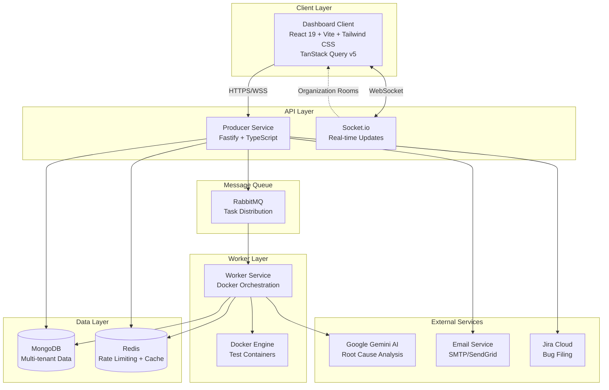

# Agnox
> Agnox enables universal test execution and instant AI debugging for modern engineering teams.

## Overview
Agnox is a unified platform designed to seamlessly integrate with your CI/CD pipelines, execute tests across any framework, and provide actionable, AI-powered root cause analysis directly in your pull requests.

[](https://docs.agnox.dev)


---

## What Problem Does This Solve?

**The Challenge:** Test automation teams struggle with:
- Managing different frameworks (Playwright, Selenium, Pytest, etc.) across environments
- Debugging failures without clear root cause analysis
- Scaling test infrastructure for multiple teams
- Maintaining secure, isolated test environments

**The Solution:** Agnox provides:
- **Framework-agnostic execution** - Bring your own Docker image, we handle the rest
- **AI-powered debugging** - Instant root cause analysis for test failures
- **Multi-tenant SaaS** - Complete isolation between teams/organizations
- **Real-time monitoring** - Live logs, WebSocket updates, interactive dashboard
- **Smart environment management** - Dynamic configuration injection per test run

---

## Key Features

### AI-Powered Root Cause Analysis

No more digging through thousands of log lines.

- **Automatic Detection:** When tests fail, the system captures logs automatically
- **Dual-Agent Pipeline:** Two sequential Gemini 2.5 Flash calls — an **Analyzer** generates a structured root cause + fix as JSON, then a **Critic** evaluates it against the raw logs and overrides hallucinations before producing the final developer-facing Markdown
- **Privacy Controls:** Organization-level toggle to opt-out of AI processing
- **Instant Reports:** View styled analysis directly in the dashboard via the Investigation Hub AI Analysis tab

### Multi-Tenant SaaS Architecture

Complete isolation and security for multiple organizations.

- **Organization Management:** Each signup creates an isolated organization
- **Team Collaboration:** Invite members with role-based permissions (Admin/Developer/Viewer)
- **Data Isolation:** Organizations cannot see or access each other's data
- **Usage Tracking:** Per-organization quotas and limits based on subscription plan

### Modern Full-Screen Dashboard

A professional React 19 + Tailwind CSS interface built for power users.

- **Full-Screen Layout:** Edge-to-edge design with no artificial width constraints, maximizing visible data
- **Collapsible Sidebar:** Persistent navigation sidebar with Dashboard, Settings, and Docs links. Collapsed state is persisted in `localStorage`
- **AppLayout / Outlet Pattern:** React Router's nested layout pattern - the `AppLayout` component renders the `<Outlet />`, ensuring the Sidebar and global chrome are shared across all pages without re-mounting
- **Manual Triggers:** Launch tests directly from the UI using the Execution Modal - Docker image, Target URL, and Test Folder are pre-filled from saved project settings
- **Live Monitoring:** Watch console logs stream in real-time via Socket.io WebSockets
- **Settings Management:** Manage team members, organization settings, usage quotas, and per-project run configuration

### Advanced Run Management

Powerful organization and control over test executions.

- **Grouped vs. Flat View:** Toggle between a flat chronological list and a grouped view that aggregates runs by `groupName`. Both views support full filtering and pagination
- **Group Collapsing:** In Grouped view, each group header shows a pass/fail summary badge and last run timestamp. Click to expand or collapse the child executions
- **Bulk Actions Bar:** A floating action bar appears when one or more rows are selected. Supports:
  - **Group Selected** - assign a group name to multiple executions at once (popover input)
  - **Ungroup Selected** - remove the group assignment from selected executions
  - **Delete Selected** - soft-delete up to 100 executions in a single operation
- **Pagination:** Both flat and grouped views are fully paginated, with "Showing X-Y of Z results" context, Prev/Next controls, and loading state dimming
- **Persistent View Mode:** The active view mode (flat or grouped) is saved to `localStorage` across sessions

### Smart Real-Time Analytics

Live KPI dashboard powered by MongoDB server-side aggregation.

- **Total Runs:** Count of all test executions in the current calendar month, scoped to the organization
- **Success Rate:** Computed as `PASSED / finishedRuns X 100`, rounded to one decimal place. Excludes in-progress runs (RUNNING, PENDING, ANALYZING) to avoid misleading percentages
- **Average Duration:** Mean execution time in milliseconds across all finished runs that have an `endTime`
- **TanStack Query Integration:** KPIs are fetched with a 60-second stale window, 2 automatic retries, and a local skeleton-loading state while the request is in flight
- **Zero-State Handling:** If no executions exist for the current month, all KPIs display as 0 without errors

### Dynamic Jira Integration

First-class bug-filing directly from the dashboard.

- **Custom Field Schema:** The Jira project's `createmeta` endpoint is fetched at modal open time. Any custom fields (`customfield_*`) defined in the project are dynamically rendered - no hardcoded field lists
- **ADF Formatting:** Issue descriptions are built using Atlassian Document Format (ADF) for rich, structured content including code blocks, bullet lists, and paragraph nodes
- **Bidirectional Linkage:** Filed tickets are stored in MongoDB and linked back to their originating execution record
- **Assignee Selection:** Supports dynamic assignee lookup and selection within the modal

### Enterprise-Grade Security

Built with security best practices from the ground up.

- **JWT Authentication:** HS256 algorithm pinning with Redis-backed revocation blacklist
- **Role-Based Access Control (RBAC):** Admin, Developer, Viewer roles
- **API Key Security:** Server-side HMAC-SHA256 hashing for secure revocation
- **Attack Surface Minimization:** Strict SSRF domain allowlisting and HMAC-signed static artifact access 
- **Data at Rest:** AES-256-GCM encryption for stored integration secrets
- **Rate Limiting:** Per-organization and per-IP rate limiting (Redis-based)
- **Account Protection:** Login attempt tracking with automatic lockout (15 min after 5 failures)
- **Security Headers:** OWASP-recommended headers (HSTS preload, CSP-ready, X-Frame-Options)
- **CORS Protection:** Environment-based origin validation

### Smart Environment Mapping & Secrets Management

Framework-agnostic environment configuration with first-class secret support. Test images and environment variables are **managed per-organization in the Database**, not in a `.env` file.

- **Per-Project Environments:** Define Dev, Staging, and Production URLs per project in **Settings → Run Settings** (stored in the database, not server ENV variables)
- **Auto-Switching:** The Execution Modal automatically maps environment selection to the correct URL
- **Dynamic Injection:** Environment variables injected into containers at runtime via Docker `Env` configuration
- **Per-Project Env Variables:** Define `KEY=VALUE` pairs under **Settings → Env Variables**. Variables are fetched and merged server-side before each run — no client-side plaintext exposure
- **Secret Encryption:** Mark any variable as **Secret** to encrypt its value at rest with AES-256-GCM. The UI returns `••••••••` for secrets; plaintext is only ever in-memory during decryption at run time
- **Log Sanitization:** The worker service automatically redacts secret values from all streamed container logs, preventing accidental leakage in the dashboard or persistent log storage

### Billing & Subscription Management

Integrated Stripe-powered subscription system.

- **Subscription Plans:** Free, Team, and Enterprise tiers with different limits
- **Stripe Integration:** Secure payment processing via Stripe Checkout
- **Plan Limits Enforcement:** Test runs, team members, concurrent runs per plan
- **Usage Tracking:** Real-time usage statistics and quota monitoring
- **Self-Service Billing:** Upgrade/downgrade plans directly from the dashboard

### User Profile Management

Personal account management for all users.

- **Profile Settings:** Update name and view account details
- **Read-Only Security:** Email and role displayed but not editable by user
- **Role-Based Access:** Profile visible to all, role changes by admins only

### Email Integration

Professional email communications via SendGrid.

- **Team Invitations:** HTML email invitations with one-click join
- **Welcome Emails:** Onboarding emails for new team members
- **Transactional Emails:** Password reset, notifications (coming soon)

---

## Connecting an Automation Project

The **Agnox CLI** ([`@agnox/agnox-cli`](https://www.npmjs.com/package/@agnox/agnox-cli)) is the official tool for preparing and connecting any test automation repository to the platform.

### Quick Start

```bash
npx @agnox/agnox-cli@latest init
```

### What It Does

- **Generates integration files** - `Dockerfile`, `entrypoint.sh`, `.dockerignore` tailored to your framework
- **Auto-detects Playwright version** from your `package.json` and pins the correct Docker base image
- **Builds a multi-platform Docker image** (`linux/amd64` + `linux/arm64`) and pushes it to Docker Hub
- **Supported frameworks:** Playwright (TypeScript/Node.js) and Pytest (Python)

### After Running the CLI

Once the image is pushed to Docker Hub:

1. Open the **Agnox Dashboard**
2. Go to **Settings → Run Settings**
3. Create a new project and enter the Docker image name
4. Configure your environment URLs (Dev/Staging/Prod)

The platform will use this image and configuration for all future test runs launched from the Execution Modal.

📦 **CLI Repository:** [github.com/agnox/agnox-cli](https://github.com/agnox/agnox-cli) ·· **npm:** [@agnox/agnox-cli](https://www.npmjs.com/package/@agnox/agnox-cli)

---

## System Architecture



### Component Overview

| Component | Technology | Purpose |
|-----------|-----------|---------|
| **Dashboard Client** | React 19 + TypeScript + Vite + Tailwind CSS + TanStack Query v5 | Full-screen UI with sidebar navigation, grouped execution views, and real-time analytics |
| **Producer Service** | Fastify + TypeScript | RESTful API, authentication, WebSocket server, analytics aggregation |
| **Worker Service** | Node.js + Docker SDK | Test execution orchestration |
| **MongoDB** | NoSQL Database | Multi-tenant data storage, server-side KPI aggregation |
| **Redis** | In-memory Cache | Rate limiting, session storage |
| **RabbitMQ** | Message Queue | Distributed task queue for test execution |
| **Google Gemini** | AI Model | Root cause analysis for test failures |
| **Email Service** | SendGrid | Team member invitations, transactional emails |

---

## Quick Start: Integrate Your Automation Project

### Step 1: Create Your Account

1. **Sign up** at the dashboard (contact: info@digital-solution.co.il for access)
2. **Your organization is created automatically**
3. **You're the admin** - invite team members via Settings → Team Members

### Step 2: Get Your API Key

1. Login to the dashboard
2. Navigate to **Settings → Profile → API Access**
3. Click **Generate API Key** and copy it (shown only once)

### Step 3: Configure Your Test Project

The platform works with **any containerized test framework**. Here's how to integrate:

#### Option A: Use the API Directly

```bash
curl -X POST https://api.agnox.dev/api/execution-request \
  -H "Content-Type: application/json" \
  -H "x-api-key: <REDACTED_API_KEY>" \
  -d '{
    "taskId": "run-'$(date +%s)'",
    "image": "mcr.microsoft.com/playwright:v1.40.0",
    "command": "npx playwright test",
    "folder": "tests/e2e",
    "groupName": "nightly-regression",
    "config": {
      "environment": "staging",
      "baseUrl": "https://staging.agnox.dev"
    }
  }'
```

#### Option B: Dedicated CI/CD Trigger (Recommended for Pipelines)

Use `POST /api/ci/trigger` to start a test cycle from your pipeline and automatically attach CI context (repository, PR number, commit SHA). The cycle appears in Test Cycles with a name derived from the repository and PR number.

**Your Project ID** is shown in **Settings → Run Settings** → Execution Defaults (copy it with the one-click button).

**GitHub Actions Example:**

```yaml
name: Run E2E Tests
on: [push, pull_request]

jobs:
  test:
    runs-on: ubuntu-latest
    steps:
      - uses: actions/checkout@v3

      - name: Trigger Tests via Agnox CI Endpoint
        run: |
          curl -X POST ${{ secrets.AGNOX_API_URL }}/api/ci/trigger \
            -H "Content-Type: application/json" \
            -H "x-api-key: ${{ secrets.AGNOX_API_KEY }}" \
            -d '{
              "projectId": "${{ secrets.AGNOX_PROJECT_ID }}",
              "image": "myorg/my-tests:latest",
              "command": "npx playwright test",
              "folder": "tests/e2e",
              "config": {
                "environment": "staging",
                "baseUrl": "${{ secrets.STAGING_URL }}"
              },
              "ciContext": {
                "source": "github",
                "repository": "${{ github.repository }}",
                "prNumber": ${{ github.event.number || 0 }},
                "commitSha": "${{ github.sha }}"
              }
            }'
```

**GitLab CI Example:**

```yaml
e2e-tests:
  stage: test
  script:
    - |
      curl -X POST $AGNOX_API_URL/api/ci/trigger \
        -H "Content-Type: application/json" \
        -H "x-api-key: $AGNOX_API_KEY" \
        -d '{
          "projectId": "'"$AGNOX_PROJECT_ID"'",
          "image": "myorg/my-tests:latest",
          "command": "npx playwright test",
          "folder": "tests/e2e",
          "config": { "environment": "staging" },
          "ciContext": {
            "source": "gitlab",
            "repository": "'"$CI_PROJECT_PATH"'",
            "commitSha": "'"$CI_COMMIT_SHA"'"
          }
        }'
```

#### Option C: Generic Execution Request

For simple runs without CI context, call the generic execution endpoint:

```bash
curl -X POST ${{ secrets.AUTOMATION_API_URL }}/api/execution-request \
  -H "Content-Type: application/json" \
  -H "x-api-key: ${{ secrets.AGNOX_API_KEY }}" \
  -d '{
    "taskId": "ci-run-'$(date +%s)'",
    "image": "mcr.microsoft.com/playwright:v1.40.0",
    "command": "npm test",
    "folder": "tests",
    "groupName": "ci-main",
    "config": {
      "environment": "production",
      "baseUrl": "https://prod.myapp.com"
    }
  }'
```

#### Option C: Node.js Integration

```javascript
const axios = require('axios');

async function runTests() {
  const response = await axios.post(
    'https://api.agnox.dev/api/execution-request',
    {
      taskId: `run-${Date.now()}`,
      image: 'mcr.microsoft.com/playwright:v1.40.0',
      command: 'npx playwright test',
      folder: 'tests/integration',
      groupName: 'smoke-suite',
      config: {
        environment: 'staging',
        baseUrl: 'https://staging.agnox.dev',
      },
    },
    {
      headers: {
        'Content-Type': 'application/json',
        'x-api-key': process.env.AAC_API_KEY,
      },
    }
  );

  console.log('Test execution started:', response.data.taskId);
}

runTests();
```

### Step 4: Monitor Test Execution

1. **Live Dashboard:** Watch tests execute in real-time at the dashboard
2. **WebSocket Updates:** See logs stream live via Socket.io
3. **AI Analysis:** If tests fail, AI automatically analyzes root cause
4. **Reports:** Access HTML and Allure reports via the dashboard

---

## Supported Test Frameworks

The platform is **framework-agnostic** - any Docker-based test framework works:

| Framework | Docker Image Example | Command Example |
|-----------|---------------------|----------------|
| **Playwright** | `mcr.microsoft.com/playwright:v1.40.0` | `npx playwright test` |
| **Cypress** | `cypress/included:13.6.0` | `cypress run` |
| **Selenium** | `selenium/standalone-chrome:latest` | `pytest tests/` |
| **Pytest** | `python:3.11-slim` | `pytest --html=report.html` |
| **JUnit** | `openjdk:17-slim` | `mvn test` |
| **Custom** | Any Docker image | Any command |

---

## API Reference

All endpoints return `{ success: boolean; data?: T; error?: string }`. Protected routes require a `Bearer` JWT token in the `Authorization` header.

### Analytics

#### GET `/api/analytics/kpis`

Returns real-time KPI metrics for the caller's organization, scoped to the current calendar month (UTC). Soft-deleted executions are excluded.

**Response:**
```json
{
  "success": true,
  "data": {
    "totalRuns": 142,
    "passedRuns": 128,
    "finishedRuns": 135,
    "successRate": 94.8,
    "avgDurationMs": 47300,
    "period": "2026-02"
  }
}
```

| Field | Description |
|-------|-------------|
| `totalRuns` | All executions in the current calendar month |
| `successRate` | `passedRuns / finishedRuns X 100`, excluding in-progress runs |
| `avgDurationMs` | Mean duration across runs that have an `endTime` |
| `period` | ISO calendar month of the aggregation window (`YYYY-MM`) |

---

### Executions

#### GET `/api/executions`

Returns a paginated, filtered list of executions for the caller's organization.

**Query Parameters:**

| Parameter | Type | Default | Description |
|-----------|------|---------|-------------|
| `limit` | number | `25` | Records per page (max `100`) |
| `offset` | number | `0` | Zero-based start index |
| `status` | string | - | Comma-separated status values: `PASSED,FAILED,ERROR,UNSTABLE` |
| `environment` | string | - | Case-insensitive match on `config.environment` |
| `startAfter` | ISO date | - | Include only executions that started after this date |
| `startBefore` | ISO date | - | Include only executions that started before this date (inclusive, extended to `23:59:59 UTC`) |
| `groupName` | string | - | Exact match on `groupName` field |

**Response:**
```json
{
  "success": true,
  "data": {
    "executions": [...],
    "total": 380,
    "limit": 25,
    "offset": 0
  }
}
```

---

#### GET `/api/executions/grouped`

Returns executions aggregated by `groupName` using a MongoDB `$group` + `$facet` aggregation pipeline. Executions without a `groupName` are placed in a synthetic `__ungrouped__` bucket.

**Query Parameters:** Same as `GET /api/executions`, except:

| Parameter | Type | Default | Description |
|-----------|------|---------|-------------|
| `limit` | number | `10` | Groups per page (max `50`) |
| `offset` | number | `0` | Zero-based group offset |

**Response:**
```json
{
  "success": true,
  "data": {
    "groups": [
      {
        "groupName": "nightly-regression",
        "totalCount": 24,
        "passCount": 22,
        "lastRunAt": "2026-02-19T23:15:00.000Z",
        "executions": [...]
      }
    ],
    "totalGroups": 8,
    "limit": 10,
    "offset": 0
  }
}
```

---

#### PATCH `/api/executions/bulk`

Updates a whitelisted field on up to 100 executions in a single operation. Currently supports setting or removing `groupName`. Passing `null` or an empty string for `groupName` removes the field (ungroups).

**Request Body:**
```json
{
  "taskIds": ["task-001", "task-002"],
  "data": { "groupName": "sprint-42" }
}
```

**Response:**
```json
{
  "success": true,
  "data": { "modifiedCount": 2 }
}
```

---

#### DELETE `/api/executions/bulk`

Soft-deletes up to 100 executions at once. Records are not removed from the database - a `deletedAt` timestamp is written to preserve billing accuracy.

**Request Body:**
```json
{
  "taskIds": ["task-001", "task-002"]
}
```

**Response:**
```json
{
  "success": true,
  "data": { "deletedCount": 2 }
}
```

---

### Execution Requests

#### POST `/api/execution-request`

Queues a new test execution. Accepts an optional `groupName` and `batchId` for grouping.

| Field | Type | Required | Description |
|-------|------|----------|-------------|
| `taskId` | string | Yes | Unique identifier for this execution |
| `image` | string | Yes | Docker image to run |
| `command` | string | Yes | Command to execute inside the container |
| `folder` | string | No | Test folder path (default: `all`) |
| `groupName` | string | No | Logical group name for grouping related runs |
| `batchId` | string | No | Batch identifier for CI/CD pipeline grouping |
| `config` | object | Yes | `{ environment, baseUrl, envVars }` |

---

## Environment Variables

> **For SaaS Users:** If you're using the hosted platform, you don't need to configure any infrastructure variables. Just generate an API key and integrate.
>
> The variables below are only needed for **self-hosting**.

### Required Variables (Self-Hosting Only)

```env
# Server
PORT=3000
NODE_ENV=production

# Infrastructure & Secrets
PLATFORM_MONGO_URI=mongodb://localhost:27017/automation_platform
PLATFORM_REDIS_URL=redis://localhost:6379
PLATFORM_RABBITMQ_URL=amqp://localhost:5672
PLATFORM_GEMINI_API_KEY=<REDACTED_GOOGLE_API_KEY>
PLATFORM_JWT_SECRET=your-super-secret-key-min-32-chars
PLATFORM_WORKER_CALLBACK_SECRET=worker-secret-key

# Internal Monitoring (ops dashboard & status.agnox.dev)
# Generate with: openssl rand -hex 32
MONITORING_SECRET_KEY=your-random-256-bit-hex-secret
```

### Optional: Billing & Email (Self-Hosting Only)

```env
# Stripe Integrations
STRIPE_SECRET_KEY=<REDACTED_STRIPE_SECRET_KEY>
STRIPE_WEBHOOK_SECRET=<REDACTED_STRIPE_WEBHOOK_SECRET>

# SendGrid (for email notifications)
SENDGRID_API_KEY=SG....
FROM_EMAIL=noreply@agnox.dev
```

### Frontend

```env
VITE_API_URL=https://api.agnox.dev
```

---

## Self-Hosting

**Want to self-host?** This platform can be deployed on your own infrastructure.

See the [Deployment Guide](docs/setup/deployment.md) for full deployment instructions including environment setup, database migration, SSL/TLS, security hardening, and scaling.

---

## What's Included

### Phase 1: Multi-Tenant Foundation ✅

**Status:** Production Ready

- Organization and User management with RBAC
- JWT-based authentication with bcrypt password hashing
- Multi-tenant data isolation (100% verified)
- Database migration script for existing data
- Security audit completed (87/100 → 92/100 score)

---

### Phase 2: User Management UI & Security ✅

**Status:** Production Ready

- Team member invitations with secure SHA-256 token hashing
- Role management (Admin/Developer/Viewer) with full RBAC enforcement
- Organization settings (AI toggle, usage tracking, plan limits)
- Redis-based rate limiting and login attempt tracking
- API Key Management for CI/CD integration

---

### Phase 3: Billing Integration ✅

**Status:** Production Ready

- Stripe subscription billing (Free, Team, Enterprise plans)
- Stripe Checkout and Customer Portal integration
- Webhook handling for payment events
- Plan limits enforcement and quota monitoring

---

### Phase 4: Project Run Settings ✅

**Status:** Production Ready

- Per-project Docker image and test folder configuration
- Per-project environment URLs (Dev, Staging, Production)
- Settings → Run Settings management tab
- Execution Modal pre-fills from project settings
- Shared types package (`@aac/shared-types`)

---

### Phase 5: Email Integration ✅

**Status:** Production Ready

- SendGrid transactional email integration
- HTML email templates for team invitations
- Welcome emails for new team members

---

### Sprint 4: Native CI/CD Integrations ✅

**Status:** Production Ready

- **Provider Strategy Pattern:** Native `CiProvider` implementations for GitHub, GitLab, and Azure DevOps.
- **Two-Way Synchronization:** The AI Engine automatically posts root cause analysis directly as comments on the originating Pull Request / Merge Request.
- **Unified API Gateway:** Single dynamic `PATCH /api/organization/integrations/:provider` endpoint for credential rotation.
- **Encrypted Storage:** All PATs and API integration secrets are stored at rest using AES-256-GCM encryption.
- **Integrations UI:** Dedicated frontend settings cards with visual connection status badges for seamlessly managing CI tokens.

---

### Sprint 5: Dashboard Evolution ✅

**Status:** Production Ready

- **Layout Overhaul:** Full-screen layout with collapsible Sidebar and AppLayout/Outlet routing pattern
- **Real-Time Analytics:** MongoDB aggregation pipeline for KPI cards (Total Runs, Success Rate, Avg Duration), powered by TanStack Query v5 with 60-second stale window
- **Advanced Pagination & Filtering:** Server-side pagination with `limit`/`offset`, multi-select status chips, environment filter, Unified Date Range Popover, and Mobile Filter Drawer
- **Run Groups:** `groupName` / `batchId` fields on executions; `GET /api/executions/grouped` endpoint with `$group`+`$facet` aggregation; collapsible group rows with pass/fail summary badges
- **Bulk Actions:** Multi-select checkboxes, floating action bar with Group / Ungroup / Delete operations; `PATCH /api/executions/bulk` and `DELETE /api/executions/bulk` endpoints using indexed soft-delete pattern
- **Dynamic Jira Integration:** `createmeta`-driven custom field rendering, ADF-formatted descriptions, bidirectional execution↔ticket linkage
- **UX Polish:** Persistent view mode in `localStorage`, scroll-locking on log panels, filter chip cleanup

---

### Sprint 7: The Investigation Hub ✅

**Status:** Production Ready

- **ExecutionDrawer:** Slide-over panel with URL-state deep-linking (`?drawerId=<taskId>`). Click any execution row to open the drawer without leaving the page
- **3-Tab Layout:** Terminal (real-time log stream), Artifacts (media gallery), AI Analysis (Gemini root-cause report)
- **ArtifactsView:** CSS Grid gallery for PNG/WebM screenshots and videos; download links for zip traces. Backed by `GET /api/executions/:taskId/artifacts`
- **TerminalView:** Live Socket.io log streaming with auto-scroll toggle and `.txt` download
- **AIAnalysisView:** Gemini-generated markdown analysis rendered in the third tab

---

### Sprint 8: CRON Scheduling & Slack Notifications ✅

**Status:** Production Ready

- **Native CRON Scheduler:** `node-cron` powered engine (`scheduler.ts`) loads all active schedules on startup and registers in-memory jobs. Jobs survive individual failures without crashing the server
- **Schedule API:** `POST /api/schedules` (create + validate CRON expression), `GET /api/schedules` (list), `DELETE /api/schedules/:id` (delete + deregister live job)
- **Dual-Mode Execution Modal:** Toggle between "Immediate" and "Schedule Run" modes. Schedule mode adds a name and CRON expression field with one-click preset buttons
- **Schedules Settings Tab:** `Settings → Schedules` lists all CRON schedules with environment badge, CRON expression, folder, and delete action (hidden for Viewer role)
- **Slack Webhook Notifications:** `notifier.ts` sends Block Kit messages to a configured Slack Incoming Webhook when an execution reaches a final status (PASSED / FAILED / ERROR / UNSTABLE). Includes AI analysis snippet for failures and a deep link to the Investigation Hub
- **Slack Configuration:** `Settings → Integrations → Slack` card - admins enter and save the org-level Incoming Webhook URL. Persisted on `organizations.slackWebhookUrl`

---

### Sprint 9: Quality Hub — Manual Testing & Hybrid Cycles ✅

**Status:** Production Ready

- **Test Case Repository:** `test_cases` MongoDB collection with full CRUD API. `TestCases.tsx` page with suite-grouped accordion view and `TestCaseDrawer.tsx` slide-over drawer for create/edit
- **AI-Powered Step Generation:** "Generate with AI" button in the test case drawer - input a natural-language intent and Gemini generates structured test steps automatically
- **Hybrid Cycle Builder:** `test_cycles` collection, `CycleBuilderDrawer.tsx` for composing manual + automated tests into cycles. Suite-grouped checkbox selection with "Select All" per suite
- **Test Cycles Page:** `TestCycles.tsx` with expandable rows showing cycle items, automation rate progress bars, pass/fail counters, and status badges
- **Manual Execution Player:** `ManualExecutionDrawer.tsx` - interactive step-by-step checklist with Pass/Fail/Skip buttons, progress bar, auto-advance, and "Complete Test" submission
- **Automated Cycle Sync:** Worker forwards `cycleId`/`cycleItemId` in execution callbacks; Producer syncs cycle item status on terminal results. Cycles auto-complete when all items reach terminal state
- **Manual Item Update API:** `PUT /api/test-cycles/:cycleId/items/:itemId` using MongoDB `arrayFilters` with automatic cycle summary recalculation

---

### Sprint 10: Reporting & Automation Infrastructure ✅

**Status:** Production Ready

- **Live HTML Cycle Reports:** `CycleReportPage.tsx` with stat cards, expandable item list, and native browser-print optimization (`@media print` forces manual steps visible, high-contrast badges)
- **Automated Version Pipeline:** `vite.config.ts` reads root `package.json` at build time and injects `__APP_VERSION__`; `VersionDisplay.tsx` renders it in the Sidebar footer
- **Changelog Modal:** Sidebar version footer is clickable; opens `ChangelogModal.tsx` with release notes for recent sprints

---

### Sprint 11: Security & RBAC Testing Strategy ✅

**Status:** Production Ready

- **3-Layer Testing Architecture:** Documented at `docs/testing/strategy.md` — Unit (Vitest), API Integration (Vitest + Supertest + MongoMemoryServer), E2E (Playwright)
- **Suite A — RBAC & Isolation:** Tests A-004 through A-008 verify cross-tenant data isolation (404), Viewer delete enforcement (403), role change restriction (403), and last-admin protection (403)
- **Redis Rate Limiting Tests:** Fully mocked `ioredis` state for deterministic lockout verification (Test A-004 — 429 after 5 failed logins)

---

### Env Variables & Secrets Management ✅

**Status:** Production Ready

- **Per-Project Env Variables:** Define `KEY=VALUE` pairs under **Settings → Env Variables**, scoped per project with full multi-tenant isolation
- **AES-256-GCM Encryption at Rest:** Secret variables (`isSecret=true`) are encrypted before MongoDB storage. GET API always returns `••••••••` for secret values
- **Server-Side Decryption & Injection:** Producer fetches and decrypts project env vars in memory at run time, merges them into the RabbitMQ task payload
- **Docker Container Injection:** Worker passes all env vars to containers via the Docker `Env` configuration array
- **Log Sanitization:** `sanitizeLogLine()` in the worker redacts secret values from every streamed log line before dashboard delivery or persistent storage
- **Settings UI:** `EnvironmentVariablesTab` with Add/Edit form, secret toggle switch, masked table view, and inline Edit/Delete actions

---

### v3.7.0 — CI/CD API Key Integration ✅

**Status:** Production Ready

- **`/api/ci/trigger` API Key Auth:** The dedicated CI/CD trigger endpoint now accepts `x-api-key` header authentication via `createApiKeyAuthMiddleware`. The global JWT middleware bypasses this route; auth is handled dynamically at the route level — tries API key first, falls back to Bearer JWT. CI tools no longer need to obtain a user Bearer token.
- **Project ID in Run Settings:** `RunSettingsTab` now displays a read-only **Project ID** field with a one-click **Copy** button at the top of the Execution Defaults section. Required when calling `POST /api/ci/trigger` from pipelines.

---

### v3.5.0 — Automated Docker Lifecycle & Multi-Tenant Reliability ✅

**Status:** Production Ready

#### Automated Test Image Sync

Every push to the `tests/` directory (or to `main`) triggers a GitHub Actions job that builds and publishes a multi-platform Docker image to Docker Hub — no manual intervention required.

- **Multi-Platform Build:** The `build-test-image` job uses Docker Buildx to produce a single manifest covering `linux/amd64` and `linux/arm64`, ensuring the image runs on both cloud VM types (Oracle Cloud ARM64 and standard x86 servers).
- **Automatic Publishing:** The image is pushed to `keinar101/agnox-tests:latest` after every successful quality-check pipeline.
- **User Workflow:** Make changes to your tests, run `git push`, and the platform handles the rest. In **Settings → Run Settings**, ensure your project's Docker Image field is set to `keinar101/agnox-tests:latest` so every subsequent execution picks up the freshly built image.
- **Manual Build:** To reproduce the CI build locally for debugging:
  ```bash
  docker buildx build \
    --platform linux/amd64,linux/arm64 \
    -t keinar101/agnox-tests:latest \
    --push .
  ```
  > Requires `docker buildx` and an active Docker Hub session (`docker login`).

#### Fair Scheduling via RabbitMQ Priority Queue

Prevents large organizations from starving smaller ones during peak load.

- **Priority Queue:** `test_queue` is declared with `x-max-priority: 10`. Every message is assigned a priority from 1 (lowest) to 10 (highest) before being enqueued.
- **Dynamic Priority Calculation:** `computeOrgPriority()` in `utils/scheduling.ts` counts an organization's currently RUNNING executions and computes `priority = max(1, 10 - runningCount * 2)`. An org already running 5 concurrent jobs receives priority 1; an idle org receives priority 10.
- **Effect:** The RabbitMQ broker delivers higher-priority messages first, ensuring active large orgs do not block idle small orgs.

#### Hardened Playwright Timeouts & Worker Scaling (Fail-Fast)

Worker efficiency is improved by bounding test execution time and scaling horizontally.

- Playwright is configured with `retries: 0` — no automatic retries on flaky failures; every failure surfaces immediately.
- A **15-second global timeout** and a **5-second `actionTimeout`** apply to each test. Long-running or stuck tests are terminated quickly, freeing the worker container for the next job.
- **Worker scaling:** `docker-compose.prod.yml` runs **10 worker replicas** via Docker Compose's `deploy.replicas: 10` with resource limits of `1.0 CPU` and `1 GB RAM` per replica. The worker service has no `container_name` so Docker can assign unique names per replica automatically.

#### Internal Monitoring Suite

Powers the ops dashboard at [status.agnox.dev](https://status.agnox.dev) with live infrastructure metrics.

- **Route:** `GET /api/system/monitor-status`
- **Auth:** Bypasses global JWT middleware. Requires the `X-Agnox-Monitor-Secret` header whose value must match the `MONITORING_SECRET_KEY` environment variable. Requests with a missing or invalid secret receive `401 Unauthorized`.
- **Response:** Returns a live JSON snapshot of RabbitMQ queue depth, active worker consumer count, and a MongoDB connectivity status.

```bash
# Example probe
curl -H "X-Agnox-Monitor-Secret: <your-secret>" \
  https://api.agnox.dev/api/system/monitor-status
```

```json
{
  "status": "ok",
  "timestamp": "2026-02-27T12:00:00.000Z",
  "data": {
    "queueDepth": 3,
    "activeWorkers": 10,
    "dbConnected": true
  }
}
```

- **Status Dashboard:** `status-dashboard.html` is a standalone single-file ops page. Open it in any browser (no build step), configure the two constants at the top (`apiBase` and `monitorSecret`), and it will auto-refresh every 30 seconds. A "Fetch Now" button triggers an immediate poll. The dashboard shows a large green/red health banner, live counters for Pending Tasks and Active Workers, and a MongoDB connectivity indicator.

> **Setup:** Add `MONITORING_SECRET_KEY=<random-256-bit-hex>` to your `.env` and to the producer service's environment block in `docker-compose.prod.yml`. Use the same value in the `CONFIG.monitorSecret` constant inside `status-dashboard.html` (or inject it via your CI/CD pipeline).

---

## Technology Stack

### Frontend
- **React 19** - Modern UI framework with concurrent rendering
- **TypeScript** - End-to-end type safety
- **Vite** - Lightning-fast build tooling
- **Tailwind CSS** - Utility-first CSS framework (all styling; no inline styles or custom CSS)
- **TanStack Query v5** - Server state management with caching, background refetch, and optimistic updates
- **Socket.io Client** - Real-time WebSocket connections
- **React Router v7** - Nested layout routing with AppLayout/Outlet pattern

### Backend
- **Fastify** - High-performance web framework
- **TypeScript** - Type-safe backend
- **MongoDB** - NoSQL database for multi-tenant data and server-side aggregation
- **Redis** - In-memory cache and rate limiting
- **RabbitMQ** - Message queue for task distribution
- **Docker SDK** - Container orchestration
- **Socket.io** - WebSocket server with organization-scoped rooms

### Security & Auth
- **JWT (jsonwebtoken)** - Stateless authentication
- **bcrypt** - Password hashing (10 rounds)
- **Redis Rate Limiting** - DDoS and brute force protection
- **CORS** - Cross-origin resource sharing
- **Security Headers** - OWASP best practices
- **AES-256-GCM** - Encryption for integration secrets (Jira tokens, etc.)

### AI & External Services
- **Google Gemini 2.5 Flash** - AI-powered root cause analysis
- **Stripe** - Subscription billing and payment processing
- **SendGrid** - Transactional email delivery
- **Jira Cloud API** - Dynamic issue creation with ADF formatting

---

## Documentation

Comprehensive documentation available in `/docs/` and at [docs.agnox.dev](https://docs.agnox.dev):

### Setup & Deployment
- **[Integration Quickstart](docs/integration/quickstart.md)** - Get started in 5 minutes
- **[Docker Setup](docs/integration/docker-setup.md)** - Container protocol for test images
- **[Deployment Guide](docs/setup/deployment.md)** - Production deployment, SSL, scaling
- **[Infrastructure Guide](docs/setup/infrastructure.md)** - Server requirements and setup
- **[CI/CD Guide](docs/setup/ci-cd.md)** - GitHub Actions and secret management
- **[Troubleshooting](docs/setup/troubleshooting.md)** - Common issues and solutions

### Features
- **[User Guide](docs/features/user-guide.md)** - Dashboard, test execution, and settings
- **[Billing Guide](docs/features/billing-guide.md)** - Plans, subscriptions, and usage

### Architecture & API
- **[Architecture Overview](docs/architecture/overview.md)** - System design and data flow
- **[API Overview](docs/api/README.md)** - Complete API reference
- **[Authentication API](docs/api/authentication.md)** - Signup, login, JWT tokens & API Keys

### Security & Operations
- **[Security Audit](docs/setup/security-audit.md)** - Comprehensive security assessment
- **[Email Configuration](docs/setup/email-configuration.md)** - SendGrid setup
- **[Kubernetes Guide](docs/setup/kubernetes.md)** - K8s deployment architecture
- **[Testing Strategy](docs/testing/strategy.md)** - Layered testing approach and coverage guidelines

---

## Security

Security is a top priority. The platform includes:

- **92/100 Security Score** (comprehensive audit completed)
- JWT authentication with bcrypt password hashing (10 rounds)
- Per-organization rate limiting (prevents noisy neighbor problem)
- Login attempt tracking (5 failures = 15-minute lockout)
- OWASP-recommended security headers
- Multi-tenant data isolation (100% verified, zero cross-org data leaks)
- CORS protection with environment-based configuration
- AES-256-GCM encryption for integration secrets
- HTTPS/TLS in production with HSTS headers

See [Security Audit](docs/setup/security-audit.md) for the detailed assessment.

---

## Running Tests

### Integration Tests

```bash
# Start services
docker-compose up -d

# Run integration tests
npm run test:integration
```

### Unit Tests

```bash
# Backend tests
cd apps/producer-service && npm test

# Frontend tests
cd apps/dashboard-client && npm test
```

### E2E Test Suite

```bash
# Full invitation flow (15 steps)
npx tsx tests/invitation-flow.e2e.test.ts

# User management
npx tsx tests/users.test.ts

# Multi-org isolation
npx tsx tests/multi-org-isolation.test.ts
```

---

## Contributing

We welcome contributions! Here's how to get started:

1. Fork the repository
2. Create a feature branch (`git checkout -b feature/amazing-feature`)
3. Commit your changes (`git commit -m 'Add amazing feature'`)
4. Push to the branch (`git push origin feature/amazing-feature`)
5. Open a Pull Request

Please read our [Contributing Guide](CONTRIBUTING.md) _(coming soon)_ for details.

---

## Project Status

| Phase | Status | Completion |
|-------|--------|------------|
| **Phase 1:** Multi-Tenant Foundation | ✅ Complete | 100% |
| **Phase 2:** User Management UI & Security | ✅ Complete | 100% |
| **Phase 3:** Billing Integration | ✅ Complete | 100% |
| **Phase 4:** Project Run Settings | ✅ Complete | 100% |
| **Phase 5:** Email Integration | ✅ Complete | 100% |
| **Sprint 5:** Dashboard Evolution | ✅ Complete | 100% |
| **Sprint 6:** Enterprise UI Overhaul | ✅ Complete | 100% |
| **Sprint 7:** The Investigation Hub | ✅ Complete | 100% |
| **Sprint 8:** CRON Scheduling & Slack Notifications | ✅ Complete | 100% |
| **Sprint 9:** Quality Hub — Manual Testing & Hybrid Cycles | ✅ Complete | 100% |
| **Sprint 10:** Reporting & Automation Infrastructure | ✅ Complete | 100% |
| **Sprint 11:** Security & RBAC Testing (Suite A) | ✅ Complete | 100% |
| **Env Variables & Secrets Management** | ✅ Complete | 100% |
| **v3.5.0: Automated Docker Lifecycle & Reliability** | ✅ Complete | 100% |

---

## Roadmap

### Q1 2026 ✅ Complete
- Phase 1: Multi-tenant foundation
- Phase 2: User management UI and security enhancements
- Phase 3: Stripe billing integration
- Phase 4: Per-project Run Settings
- Phase 5: Email integration (SendGrid)
- Sprint 5: Full-screen layout, real-time analytics, run groups, bulk actions, Jira ADF integration
- Sprint 6: GitHub-inspired Theme Engine, Dark Mode, and UI Hardening
- Sprint 7: Investigation Hub - ExecutionDrawer, ArtifactsView, AI Analysis tab
- Sprint 8: CRON scheduling engine, Slack webhook notifications, Schedules settings tab
- Sprint 9: Quality Hub — manual test case repository, AI-powered step generation, hybrid cycle builder, manual execution player
- Sprint 10: Live HTML cycle reports, automated version pipeline (`VersionDisplay`, Vite build injection)
- Sprint 11: 3-layer testing architecture — Unit (Vitest), API Integration (Supertest + MongoMemoryServer), E2E (Playwright), Suite A RBAC coverage
- Env Variables & Secrets Management: per-project env vars with AES-256-GCM encryption, secret masking, Docker injection, log sanitization
- v3.5.0: Automated multi-platform Docker image sync via GitHub Actions Buildx, RabbitMQ priority queue for fair scheduling, Playwright fail-fast timeouts (0 retries / 15s global), `GET /api/system/monitor-status` monitoring endpoint powering status.agnox.dev

### Q2 2026
- Advanced analytics dashboards and trend charts
- Audit logging and compliance features
- x86 Worker Support for dedicated Chrome/Edge infrastructure

### Q3 2026
- Enterprise features (SSO/SAML)
- Terraform / IaC templates
- 99.9% uptime SLA

---

## License

This project is licensed under the MIT License - see the [LICENSE](LICENSE) file for details.

---

## Acknowledgments

- **Google Gemini AI** for powerful root cause analysis capabilities
- **Fastify** for blazing-fast API performance
- **React + Vite** for excellent developer experience
- **MongoDB** for flexible multi-tenant data modeling and server-side aggregation
- **TanStack Query** for best-in-class server state management
- **Docker** for framework-agnostic test execution

---

## Support & Contact

- **Documentation:** [docs.agnox.dev](https://docs.agnox.dev)
- **Issues:** [GitHub Issues](https://github.com/keinar/Agnostic-Automation-Center/issues)
- **Discussions:** [GitHub Discussions](https://github.com/keinar/Agnostic-Automation-Center/discussions)
- **Email:** info@digital-solution.co.il

---

**Built for test automation teams everywhere**

Made by developers, for developers. Framework agnostic. AI-powered. Multi-tenant. Secure.
