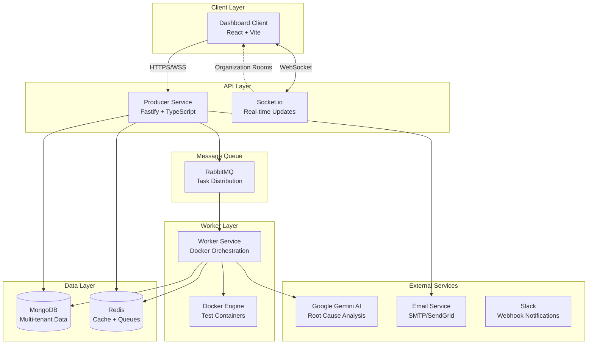
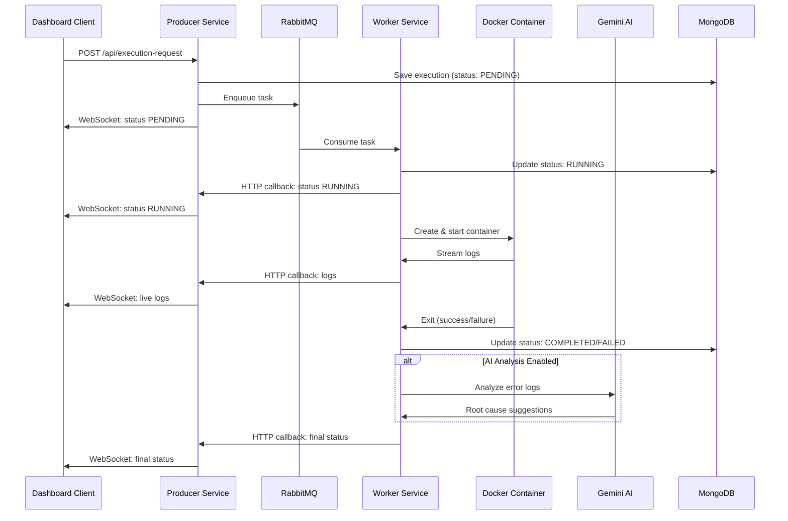
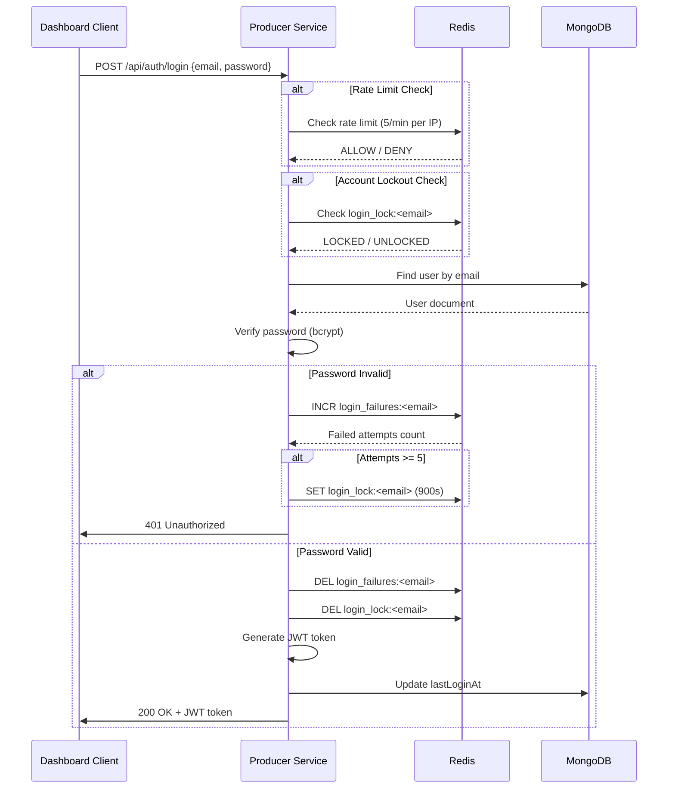
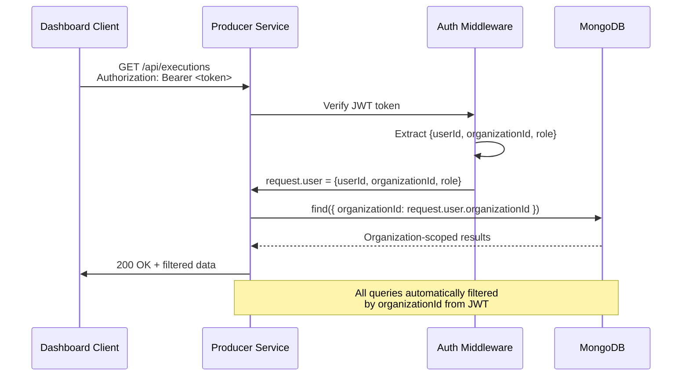

# Architecture Overview

## System Architecture

The Agnostic Automation Center is a microservices-based test automation platform designed for multi-tenant SaaS deployment.



---

## Component Responsibilities

### Dashboard Client (`apps/dashboard-client/`)
**Technology:** React 19 + TypeScript + Vite + Tailwind CSS

**Responsibilities:**
- User interface for test execution, monitoring, and management
- Real-time test logs and status updates via Socket.io
- Organization and user management settings
- Team member invitations and role management

**Key Features:**
- Mobile-responsive design powered strictly by Tailwind CSS
- Real-time WebSocket connection with JWT authentication
- Auth context for global authentication state
- Settings pages (Organization, Members, Security, Usage)

**Port:** 8080 (exposed via Docker Compose)

---

### Producer Service (`apps/producer-service/`)
**Technology:** Fastify + TypeScript + MongoDB + Redis + RabbitMQ

**Responsibilities:**
- RESTful API server for all client requests
- Authentication and authorization (JWT-based)
- Multi-tenant data isolation (organizationId filtering)
- Task queuing via RabbitMQ
- WebSocket server for real-time updates
- Static file serving (HTML test reports)

**Key Features:**
- HS256 JWT authentication with Redis-backed revocation blacklist
- Role-Based Access Control (Admin, Developer, Viewer)
- Redis-based rate limiting (per-organization + per-IP)
- Security headers (HSTS preload, CSP, X-Frame-Options)
- Login attempt tracking with account lockout
- CORS production configuration
- Email service integration (invitations)

**Port:** 3000 (internal)

**Routes:**
- `/api/auth/*` - Authentication (signup, login, logout)
- `/api/users/*` - User management (admin only)
- `/api/organization/*` - Organization settings (including `slackWebhookUrl`)
- `/api/invitations/*` - Team member invitations (admin only)
- `/api/executions/*` - Test execution history, bulk ops, artifact listing
- `/api/execution-request` - Queue new test execution
- `/api/schedules/*` - CRON schedule management (create, list, delete)
- `/api/test-cases/*` - Manual test case CRUD with AI step generation (Sprint 9)
- `/api/test-cycles/*` - Hybrid test cycle management + item updates (Sprint 9)
- `/api/metrics/:image` - Performance insights
- `/reports/*` - Static HTML test reports

---

### Worker Service (`apps/worker-service/`)
**Technology:** Node.js + TypeScript + Docker SDK

**Responsibilities:**
- Consume tasks from RabbitMQ queue
- Orchestrate Docker containers for test execution
- Stream live test logs to Producer Service
- Collect test results and reports
- Optional AI-powered root cause analysis (Gemini API)

**Key Features:**
- Dynamic Docker container creation (custom images supported)
- Live log streaming via HTTP callbacks to Producer
- AI analysis with organization-level opt-out
- Test report extraction (HTML, JSON, XML)
- Performance metrics tracking (Redis)

**Key Files:**
- `worker.ts` - Main consumer and orchestrator
- `analysisService.ts` - Google Gemini AI integration

---

### MongoDB
**Purpose:** Primary data store for multi-tenant data

**Collections:**
- `organizations` - Organization details, plans, limits, billing (Stripe sub-document), AI preferences, `slackWebhookUrl`
- `users` - User accounts, roles, authentication data
- `invitations` - Team member invitations (pending/accepted/expired)
- `executions` - Test execution history and results
- `projects` - Project definitions per organization (name, Docker image, test folder)
- `projectRunSettings` - Per-project environment URLs (Dev, Staging, Production)
- `apiKeys` - Hashed API keys for CI/CD integration
- `audit_logs` - Admin action audit trail
- `webhook_logs` - Stripe webhook event log
- `schedules` - CRON schedule definitions (Sprint 8): expression, environment, image, folder, baseUrl
- `test_cases` - Manual and automated test case definitions (Sprint 9): steps array, suite grouping, AI-generated content
- `test_cycles` - Hybrid test cycles (Sprint 9): items array with status tracking, summary stats, cycle-level status

**Indexes:**
- `organizationId` - All collections (multi-tenant filtering)
- `email` - Users (unique, login lookup)
- `tokenHash` - Invitations (unique, validation)
- `slug` - Organizations (unique, URL-friendly)
- `stripeCustomerId` - Organizations (Stripe integration lookup)

**Port:** 27017

---

### Redis
**Purpose:** Caching, rate limiting, login tracking, performance metrics

**Use Cases:**
- Rate limiting counters (per-organization, per-IP)
- Login attempt tracking (brute force prevention)
- Account lockout state (15-minute duration)
- Performance metrics (test duration history)
- Active token revocation blacklist (JWT)

**Port:** 6379

---

### RabbitMQ
**Purpose:** Task queue for test execution distribution

**Queue:** `automation_queue`
**Message Format:**
```json
{
  "taskId": "unique-id",
  "organizationId": "org-id",
  "image": "docker-image:tag",
  "command": "npm test",
  "tests": ["test1", "test2"],
  "config": { "baseUrl": "...", "envVars": {} },
  "cycleId": "optional-cycle-id",
  "cycleItemId": "optional-cycle-item-id"
}
```

**Port:** 5672 (AMQP), 15672 (Management UI)

---

## Data Flow

### Test Execution Flow



---

### Authentication Flow



---

### Multi-Tenant Data Isolation



---

## Security Architecture

### Multi-Layer Security

1. **Network Layer**
   - HTTPS/TLS in production
   - CORS origin validation (environment-based)
   - Security headers (HSTS, X-Frame-Options, CSP)

2. **Application Layer**
   - JWT authentication (HS256, 24h expiration)
   - Password hashing (bcrypt, 10 rounds)
   - Role-Based Access Control (RBAC)
   - Redis-based rate limiting (per-org + per-IP)
   - Login attempt tracking (5 attempts, 15-minute lockout)

3. **Data Layer**
   - Multi-tenant data isolation (organizationId filtering)
   - MongoDB user authentication
   - Encrypted connections (TLS)

4. **API Layer**
   - Input validation on all endpoints
   - Parameterized queries (MongoDB, no SQL injection)
   - Authorization checks before data access
   - 404 responses to prevent information leakage

### Authentication & Authorization

**Roles:**
- **Admin:** Full access (invite users, change roles, modify organization)
- **Developer:** Execute tests, view results, manage own profile
- **Viewer:** Read-only access to test results

**JWT Claims:**
```json
{
  "userId": "507f1f77bcf86cd799439011",
  "organizationId": "507f191e810c19729de860ea",
  "role": "admin",
  "iat": 1706947200,
  "exp": 1707033600
}
```

---

## Scalability Considerations

### Horizontal Scaling

**Producer Service:**
- Stateless design (all state in MongoDB/Redis)
- Can run multiple instances behind load balancer
- Socket.io with Redis adapter for multi-instance support (future)

**Worker Service:**
- Horizontally scalable (multiple workers consume from same queue)
- RabbitMQ distributes tasks across workers
- Each worker manages its own Docker containers

### Performance Optimizations

**Caching:**
- Redis for rate limit counters (fast in-memory lookups)
- MongoDB indexes on frequently queried fields
- Static file serving with caching headers

**Database:**
- Compound indexes on `{organizationId, status, startTime}`
- Pagination for large result sets
- Connection pooling (MongoDB driver default)

---

## Deployment Architecture

### Development (Docker Compose)

```yaml
services:
  dashboard-client:      # React app (port 8080)
  producer-service:      # API server (port 3000)
  worker-service:        # Task processor
  mongodb:               # Database (port 27017)
  redis:                 # Cache (port 6379)
  rabbitmq:              # Message queue (port 5672, 15672)
```

### Production Considerations

- **Reverse Proxy:** Nginx/Traefik for HTTPS termination
- **Database:** MongoDB replica set for high availability
- **Redis:** Redis Sentinel for failover
- **RabbitMQ:** Clustered setup for reliability
- **Monitoring:** Prometheus + Grafana for metrics
- **Logging:** Centralized logging (ELK stack or similar)
- **Backups:** Automated MongoDB backups to S3/cloud storage

---

## Technology Stack Summary

| Component | Technology | Purpose |
|-----------|-----------|---------|
| **Frontend** | React 19 + TypeScript + Vite | User interface |
| **Styling** | Tailwind CSS | Mobile-responsive design |
| **Backend API** | Fastify + TypeScript | RESTful API server |
| **Real-time** | Socket.io | WebSocket connections |
| **Database** | MongoDB | Multi-tenant data storage |
| **Cache** | Redis | Rate limiting, sessions |
| **Queue** | RabbitMQ | Task distribution |
| **Container** | Docker SDK | Test execution isolation |
| **AI** | Google Gemini API | Root cause analysis |
| **Email** | SendGrid (`@sendgrid/mail`) | Invitation emails, transactional notifications |
| **Auth** | JWT (jsonwebtoken) | HS256 stateless authentication + Redis Blacklist |
| **Password** | bcrypt | Secure password hashing |

---

## Design Principles

1. **Multi-Tenancy First:** All features designed with organization isolation
2. **Security by Default:** Authentication, authorization, rate limiting built-in
3. **Framework Agnostic:** Support any Docker image and test framework
4. **Real-time Experience:** WebSocket updates for live test monitoring
5. **Scalable Architecture:** Stateless services, message queue, caching
6. **Developer Experience:** Clear APIs, comprehensive documentation
7. **Privacy Controls:** Organization-level AI opt-out capability

---

## Related Documentation

- [API Documentation](../api/README.md)
- [Deployment Guide](../setup/deployment.md)
- [Security Audit](../setup/security-audit.md)

---

## Known Limitations

### Google Chrome on ARM64 Servers

The AAC platform currently runs on a Linux ARM64 server (Oracle Cloud).
Google Chrome and Microsoft Edge do **not** support Linux ARM64.

**Impact:** Test projects that use `--browser-channel chrome` or
`--browser-channel msedge` in their `pytest.ini` or Playwright config
will fail with:

```
BrowserType.launch: Chromium distribution 'chrome' is not found
```

**Workaround:** Remove `--browser-channel chrome` from your pytest/Playwright
config and use `--browser chromium` instead. Chromium is fully supported
on ARM64 and produces identical results for most web applications.

**Roadmap:** Full Chrome/Edge support on x86 infrastructure is planned.
See roadmap below.
